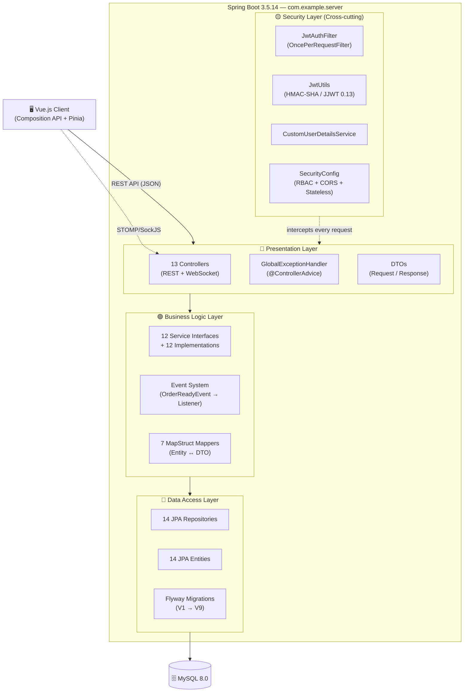

# PHẦN 2 — KIẾN TRÚC HỆ THỐNG

## 2.1. Mô hình kiến trúc tổng quan

Hệ thống áp dụng kiến trúc **Phân tầng (Layered Architecture)** kết hợp mô hình **Client-Server** hiện đại. Backend cung cấp các RESTful API và WebSocket endpoints cho Frontend tiêu thụ, đảm bảo tính tách biệt hoàn toàn giữa giao diện và logic xử lý.

## 2.2. Chi tiết các tầng

### 2.2.1. Presentation Layer (Tầng trình diễn)
- **Controllers**: 13 REST Controllers xử lý hơn 60 endpoints.
- **WebSocket**: 1 Controller chuyên biệt xử lý luồng vị trí thời gian thực của Shipper.
- **Validation**: Jakarta Validation (@Valid, @NotBlank, @Email) được áp dụng tại tầng này để đảm bảo dữ liệu đầu vào sạch.
- **Global Error Handling**: Centralized mapping của các ngoại lệ thành chuẩn `ApiResponse` với Error Codes nghiệp vụ.

### 2.2.2. Business Logic Layer (Tầng nghiệp vụ)
- **Services**: 12 interfaces và implementations tương ứng. Tách rời hoàn toàn logic nghiệp vụ khỏi Controller.
- **Event-Driven Architecture**: Sử dụng `OrderReadyEvent` để kích hoạt việc tạo `DeliveryAssignment` ngay khi đơn hàng sẵn sàng, đảm bảo tính nhất quán qua `TransactionalEventListener`.
- **Map Integration**: Tích hợp Nominatim và OSRM APIs để tính toán khoảng cách và phí giao hàng động mà không làm treo database transaction.

### 2.2.3. Security Layer (Tầng bảo mật)
- **Stateless JWT**: Toàn bộ thông tin User được trích xuất từ JWT claims, loại bỏ các truy vấn database không cần thiết trong filter chain.
- **RBAC (Role-Based Access Control)**: Phân quyền chặt chẽ tới từng endpoint và phương thức dịch vụ.
- **WebSocket Security**: Xác thực JWT ngay tại frame CONNECT của STOMP, đảm bảo chỉ người dùng hợp lệ mới có thể gửi/nhận tin nhắn real-time.

### 2.2.4. Data Access Layer (Tầng dữ liệu)
- **14 JPA Entities**: Bao gồm các bảng lõi và các bảng quản lý yêu cầu (OwnerRequest, ShipperRequest).
- **Concurrency Control**: Sử dụng `@Version` (Optimistic Locking) trên `Order` và `DeliveryAssignment` để ngăn chặn xung đột khi nhiều actor cập nhật cùng lúc.
- **Flyway**: Quản lý schema lịch sử từ V1 đến V9, đảm bảo môi trường phát triển và production luôn đồng bộ.

## 2.3. Cấu hình Runtime & Profiles
- **Profile `dev`**: Tối ưu cho lập trình viên (H2/MySQL local, debug logging).
- **Profile `prod`**: Tối ưu cho triển khai (Hardened security, environment variables).
- **Smoke Mode**: Chế độ khởi động nhanh không cần DB để kiểm tra cấu hình application context.
