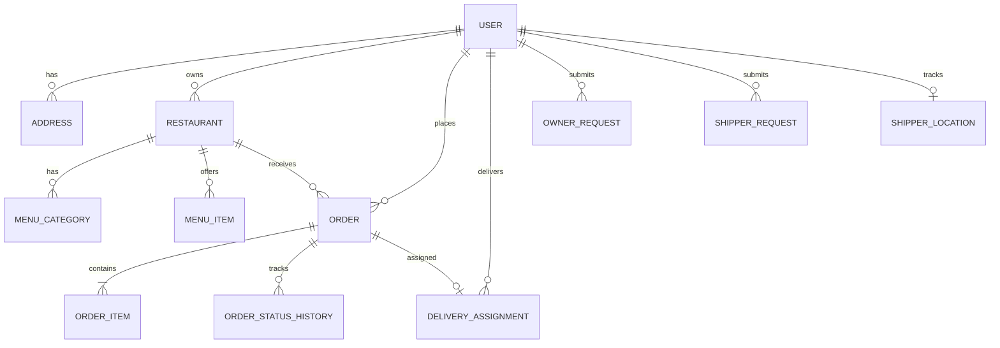

# PHẦN 3 — THIẾT KẾ DỮ LIỆU

## 3.1. Mô hình Thực thể - Quan hệ (ERD)

Hệ thống quản lý 14 thực thể JPA, được ánh xạ vào MySQL 8.0. Điểm nhấn là việc sử dụng **Snapshot Pattern** cho chi tiết đơn hàng và **Optimistic Locking** cho các giao dịch quan trọng.

## 3.2. Danh sách thực thể trọng tâm

### 3.2.1. User & Security
- **User**: Lưu trữ thông tin định danh, Role (CUSTOMER, OWNER, SHIPPER, ADMIN), trạng thái hoạt động và cờ xóa mềm (is_deleted).
- **OwnerRequest / ShipperRequest**: Quản lý quy trình nâng cấp vai trò người dùng thông qua phê duyệt của Admin.

### 3.2.2. Nhà hàng & Thực đơn
- **Restaurant**: Chứa thông tin vị trí (lat/lng precision 10,8), giờ hoạt động, cờ phê duyệt và cờ hoạt động.
- **MenuCategory & MenuItem**: Cấu trúc thực đơn đa cấp. MenuItem hỗ trợ URL hình ảnh dung lượng lớn (LONGTEXT) để lưu trữ Base64 hoặc link CDN.

### 3.2.3. Đơn hàng & Giao vận
- **Order**: Thực thể giao dịch chính. Sử dụng `@Version` để quản lý phiên bản. Lưu trữ thông tin tài chính (subtotal, delivery_fee, total_amount) và trạng thái thanh toán (is_paid).
- **OrderItem (Snapshot)**: Lưu trực tiếp `item_name` và `item_price` tại thời điểm đặt để bảo toàn dữ liệu lịch sử nếu menu thay đổi.
- **DeliveryAssignment**: Quản lý trạng thái giao hàng. `shipper_id` có thể null ở trạng thái UNASSIGNED (Migration V6). Sử dụng `@Version` để ngăn shipper nhận trùng đơn.
- **ShipperLocation**: Lưu trữ tọa độ GPS mới nhất và trạng thái online/offline của Shipper.

### 3.2.4. Tiện ích & Thông báo
- **Notification**: Hệ thống thông báo đa dạng (SYSTEM, ORDER, SYSTEM_ERROR) hỗ trợ đánh dấu đã đọc hàng loạt.
- **Address**: Quản lý sổ địa chỉ của người dùng với nhãn tùy chỉnh và tọa độ địa lý.

## 3.3. Đặc điểm Kỹ thuật
- **Optimistic Locking**: Triển khai tại `Order` và `DeliveryAssignment` nhằm ngăn chặn tình trạng "Lost Update" khi Customer, Owner và Shipper cùng cập nhật trạng thái đơn hàng.
- **Soft Delete**: Áp dụng rộng rãi (User, Restaurant, Category, MenuItem) để duy trì tính toàn vẹn tham chiếu cho các báo cáo lịch sử.
- **Geospatial Precision**: Tọa độ được lưu dưới dạng `DECIMAL(10,8)` và `DECIMAL(11,8)` đảm bảo độ chính xác cấp milimet.
- **N+1 Avoidance**: Sử dụng `@EntityGraph` trong các Repository để fetch các mối quan hệ (Eager load) trong một truy vấn duy nhất.

## 3.4. Lịch sử Migration (Flyway)
- **V1-V3**: Khởi tạo schema và seed dữ liệu danh mục.
- **V4-V5**: Thêm OwnerRequest và ràng buộc Cascade Deletes.
- **V6**: Cho phép `shipper_id` null trong `delivery_assignments` để hỗ trợ luồng tự động.
- **V7-V8**: Thêm ShipperRequest và mở rộng kích thước `image_url` lên LONGTEXT.
- **V9**: Bổ sung cột `version` cho tất cả các bảng cần Optimistic Locking.
